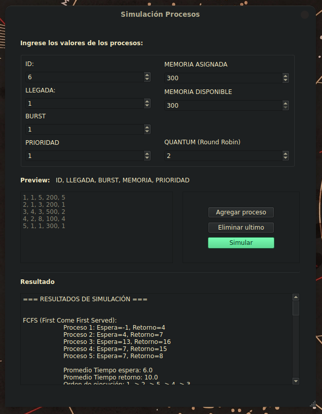

# Informe: Simulación de Planificación de Procesos y Gestión de Memoria

- **Estudiante:** Jorge Iván Acosta Aristizábal

---



---

## Explicación del codigo

El programa fué escrito en Python y se divide en 2 partes
fundamentalmente:

- La lógica que provee la clase `Proceso` en el fichero
`modules/proceso.py`

- La interfaz gráfica, simplemente un envoltorio para la lógica,
que pertenece a la clase `MainWindow` en el fichero
`modules/client.py`

En este documento voy a explicar unicamente la parte lógica que
es la determinante en la simulación de los algoritmos de
planificación de procesos.

### Análisis de metodos en proceso.py

#### FCFS (First-Come, First-Served)

Ordena los procesos por su tiempo de llegada y los recorre en orden. Para cada proceso, calcula el tiempo de espera como la diferencia entre el tiempo actual y su llegada, luego suma su tiempo de ejecución (`burst`) al tiempo actual y calcula el tiempo de retorno. También construye una cadena con el orden de ejecución y la devuelve junto con la lista de procesos actualizada.

```python
    def fcfs(procesos):
        tiempo_actual = 0
        orden = "Orden de ejecución: "
        for p in sorted(procesos, key=lambda x: x.llegada):
            orden += str(p.id) + " -> "
            p.tiempo_espera = tiempo_actual - p.llegada
            tiempo_actual += p.burst
            p.tiempo_retorno = tiempo_actual - p.llegada

        orden = orden[:-3]

        return (procesos, orden)
```

#### SJF (Shortest Job First)

Implementa el algoritmo Shortest Job First (SJF) no expropiativo. Ordena los procesos por llegada y duración (burst). En cada iteración, selecciona el proceso disponible con el menor burst. Si no hay procesos listos, incrementa el tiempo. Calcula los tiempos de espera y retorno para cada proceso, construye la cadena de ejecución y la devuelve junto con la lista de procesos actualizada.

```python
    def sjf(procesos):
        tiempo_actual = 0
        orden = "Orden de ejecución: "
        cola = sorted(procesos, key=lambda x: (x.llegada, x.burst))
        while cola:
            p = next((p for p in cola if p.llegada <= tiempo_actual), None)
            if not p:
                tiempo_actual += 1
                continue
            
            orden += str(p.id) + " -> "
            p.tiempo_espera = tiempo_actual - p.llegada
            tiempo_actual += p.burst
            p.tiempo_retorno = tiempo_actual - p.llegada
            cola.remove(p)

        orden = orden[:-3]
        return (procesos, orden)
```

#### Round Robin

Implementa el algoritmo **Round Robin** para planificación de procesos. Usa una cola circular donde cada proceso ejecuta un máximo de `quantum` unidades de tiempo antes de ser reinsertado si aún le queda ejecución. Si su `burst` es menor o igual al `quantum`, finaliza y se calculan sus tiempos de espera y retorno. Construye una cadena con el orden de ejecución y la devuelve junto con la lista de procesos actualizada.

```python
    def round_robin(procesos, quantum):
        tiempo_actual = 0
        cola = list(procesos)
        orden = "Orden de ejecución: "
        while cola:
            p = cola.pop(0)
            if p.burst > quantum:
                tiempo_actual += quantum
                p.burst -= quantum
                cola.append(p)
            else:
                orden += str(p.id) + " -> "
                tiempo_actual += p.burst
                p.tiempo_retorno = tiempo_actual - p.llegada
                p.tiempo_espera = p.tiempo_retorno - p.burst

        orden = orden[:-3]
        return (procesos, orden)
```

#### Prioridad

Implementa el algoritmo **de planificación por prioridad no expropiativo**. Mantiene una cola de procesos listos, agregando los que llegan en cada instante. Si la cola está vacía, avanza el tiempo al siguiente proceso disponible. Ordena la cola por prioridad (valor más bajo es más prioritario) y ejecuta el proceso con mayor prioridad. Calcula los tiempos de espera y retorno, construye la cadena con el orden de ejecución y la devuelve junto con la lista de procesos actualizada.

```python
    def prioridad(procesos):
        tiempo_actual = 0
        cola = [] 
        procesos_restantes = procesos.copy()
        orden = "Orden de ejecución: "
    
        while procesos_restantes or cola:
            nuevos_procesos = [p for p in procesos_restantes if p.llegada <= tiempo_actual]
            for p in nuevos_procesos:
                cola.append(p)
                procesos_restantes.remove(p)
        
            if not cola:
                tiempo_actual = min(p.llegada for p in procesos_restantes)
                continue
        
            cola.sort(key=lambda x: x.prioridad)  # Ordenar por prioridad
            p = cola[0]  # Tomar el más prioritario
        
            orden += f"{p.id} -> "
            p.tiempo_espera = tiempo_actual - p.llegada
            tiempo_actual += p.burst
            p.tiempo_retorno = tiempo_actual - p.llegada
            cola.remove(p)
    
        orden = orden[:-4]  # Eliminar el último " -> "
        return (procesos, orden)
```

#### FMS (First-Memory-Served)

Implementa un **planificador con gestión de memoria fija (FMS)**. Filtra los procesos que no caben en la memoria total y los ordena por llegada. En cada iteración, busca el primer proceso que pueda ejecutarse dentro de la memoria disponible. Si no hay procesos listos, avanza el tiempo al próximo evento relevante. Ejecuta el proceso seleccionado, ajusta la memoria disponible, calcula los tiempos de espera y retorno, y libera la memoria al finalizar. Devuelve la lista de procesos ejecutados y el orden de ejecución.

```python

    def fms(procesos, memoria_total):
        tiempo_actual = 0
        cola = sorted([p for p in procesos if p.memoria <= memoria_total], key=lambda x: x.llegada)  # Filtrar procesos imposibles
        memoria_disponible = memoria_total
        procesos_ejecutados = []
        orden = "Orden de ejecución: "
    
        while cola:
            proceso_elegido = None
            for p in cola:
                if p.llegada <= tiempo_actual and p.memoria <= memoria_disponible:
                    proceso_elegido = p
                    break
        
            if not proceso_elegido:
                if not cola:
                    break  # No hay más procesos
            
                proxima_llegada = min(p.llegada for p in cola if p.llegada > tiempo_actual)
                tiempo_actual = proxima_llegada
                continue
        
            # Ejecutar el proceso
            orden += str(p.id) + " -> "
            memoria_disponible -= proceso_elegido.memoria
            proceso_elegido.tiempo_espera = tiempo_actual - proceso_elegido.llegada
            tiempo_actual += proceso_elegido.burst
            proceso_elegido.tiempo_retorno = tiempo_actual - proceso_elegido.llegada
            memoria_disponible += proceso_elegido.memoria  # Liberar memoria
            cola.remove(proceso_elegido)
            procesos_ejecutados.append(proceso_elegido)
    
        orden = orden[:-3]
        return (procesos_ejecutados, orden)
```

---

## Análisis de Resultados de Simulación

### Datos de simulación

| ID | Llegada | Burst | Memoria | Prioridad |
|----|---------|-------|---------|-----------|
| 1  | 1       | 5     | 200     | 5         |
| 2  | 1       | 3     | 200     | 1         |
| 3  | 4       | 3     | 500     | 2         |
| 4  | 2       | 8     | 100     | 4         |
| 5  | 1       | 1     | 300     | 1         |

### Comparación de Algoritmos

| Algoritmo       | Prom. Espera | Prom. Retorno | Orden Ejecución          | Observaciones                         |
|-----------------|--------------|---------------|--------------------------|---------------------------------------|
| **FCFS**        | 6.0          | 10.0          | 1 → 2 → 5 → 4 → 3        | Proceso 3 sufre por llegada tardía    |
| **SJF**         | 5.4          | 9.4           | 5 → 2 → 1 → 4 → 3        | Optimiza tiempos cortos               |
| **Round Robin** | 11.0         | 12.2          | 5 → 2 → 3 → 1 → 4        | Alto overhead por quantum pequeño     |
| **Prioridad**   | 1.6          | 2.8           | 2 → 5 → 4 → 3 → 1        | Prioridad 1 (menor=número) domina    |
| **FMS (300MB)** | 1.0          | 2.0           | 1 → 2 → 5 → 4            | Proceso 3 (500MB) se excluye          |


### Preguntas de Análisis

#### 1. ¿Cómo afecta la memoria en FMS?

- **Ejemplo**: Con 300MB de memoria:
  - Procesos ejecutados: 1, 2, 5, 4 (todos ≤300MB).
  - Proceso 3 (500MB) **no se ejecuta**.
- **Impacto**:
  - Mejora tiempos promedio (excluye procesos inviables).
  - Puede causar inanición para procesos con alta demanda de memoria.

#### 2. ¿Si un proceso excede la memoria disponible?

- **Comportamiento**:
  - El proceso **no se carga** (ej: Proceso 3 en FMS).
  - No se considera en estadísticas (espera/retorno).
- **Consecuencia**:
  - Reduce el throughput del sistema.
  - Requiere manejo explícito (ej: notificar al usuario).

#### 3. ¿Cuándo combinar FMS con otros algoritmos?

| Escenario                  | Combinación Recomendada       | Beneficio                                  |
|----------------------------|-------------------------------|--------------------------------------------|
| Procesos interactivos      | **FMS + Round Robin**         | Equidad + gestión memoria                  |
| Procesos batch largos      | **FMS + SJF**                 | Optimiza memoria y tiempo de ejecución     |
| Sistemas con prioridades   | **FMS + Prioridad**           | Garantiza recursos para procesos críticos  |
